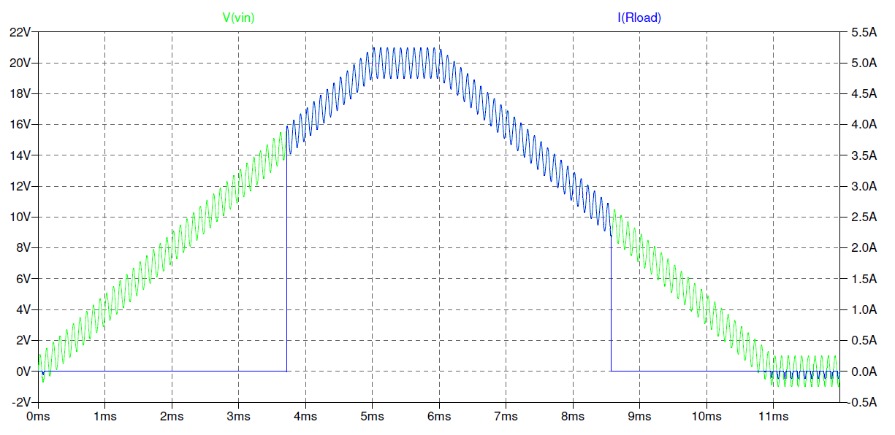

Undervoltage lockout circuit
============================

An undervoltage lockout (UVLO) is a power monitoring circuit, that will disable a connected device when the supply voltage drops below a certain threshold.

This circuit was originally designed to allow Apple Magsafe adapters to power any kind of device (provided voltage and current ratings are matched). Apple adapters initially start in a high output impedance mode, and need to be powered on by connecting a load resistor of 39 kΩ. After the adapter powers on, the actual load may be connected. The given UVLO circuit performs exactly this function and operation has been verified using several genuine Apple adapters. For more information about Apple adapters, see Ken Shirriff's excellent teardown at `http://www.righto.com/2015/11/macbook-charger-teardown-surprising.html <http://www.righto.com/2015/11/macbook-charger-teardown-surprising.html>`_.

Features
--------

- Input voltage range 3.3–20V
- Low leakage in the off state
- Adjustable hysteresis
- Digital disable input
- Fully discrete circuit using generic components
- Optional power switching circuit

Theory of operation
-------------------

The circuit is based around a zener diode (D1) which is connected between input and the base of an NPN transistor (Q1). When the input voltage rises, the zener diode begins conducting, raising the base voltage of Q1. When the base voltage reaches around 0.7 V, the transistor turns on, which in turn turns on a PNP series pass transistor (Q2), connecting the input voltage to the UVLO output. A positive feedback resistor (R5) yields a voltage hysteresis by feeding back some of the output voltage to the base of Q1. Below threshold, the input current is dictated by the zener leakage current, which is typically less than 1 µA.

To adjust the turn-on voltage of the circuit, select an appropriate value for the zener diode D1. For very low input voltages, an LED or (series of) silicium diodes can also be used to achieve a certain desired voltage drop.

To adjust the turn-off voltage (hysteresis), adjust the feedback resistor R5.

Figure shows input voltage vs. output current. Note the sharp turn-on and turn-off, difference between turn-on and turn-off voltages due to hysteresis, and immunity to an added sinusoidal noise source (1V at 10 kHz).
   

Optional high-side power switch
-------------------------------

In addition to the UVLO itself, the schematic also includes the circuit for a high-side power switch using a power MOSFET. This part of the circuit is optional and not needed if all you need is a logic signal to, for example, hold a downstream microcontroller in RESET.

The power switch consists of Q3-5, R7-10 and D2. A fast turn-off of the MOSFET is achieved by R8, R9 and Q4. Turning the MOSFET on occurs by pulling the gate low via D2, which can be implemented as a regular silicium diode, but has here been implemented as an LED to allow the larger forward voltage to act as extra margin between the maximum gate-source voltage of the FET, which is typically 20V. Note that the LED also functions as an indicator light for "output on", but is actually used for its electrical characteristics.

Component selection
-------------------

All transistors except the power MOSFET are generic low-voltage low-current, e.g. BC337/BC327 or BC848/BC858.

Select zener diode D1 for low leakage and sharp inflection near the breakdown voltage.

Main selection criterion for the MOSFET is a low on resistance R_DS,on. Make sure that the maximum gate-source voltage is equal to or greater than the maximum input voltage.

Schematic
---------

`Schematic (.pdf) <uvlo_schematic.pdf>`_

`LTspice simulation (.asc) <uvlo_circuit_ltspice.asc>`_

Licence
-------

If you use or improve on this circuit, please send me your feedback!

February 2019, Charl Linssen <charl@itfromb.it>

Released under the CC0 1.0 Universal ("public domain") licence.

